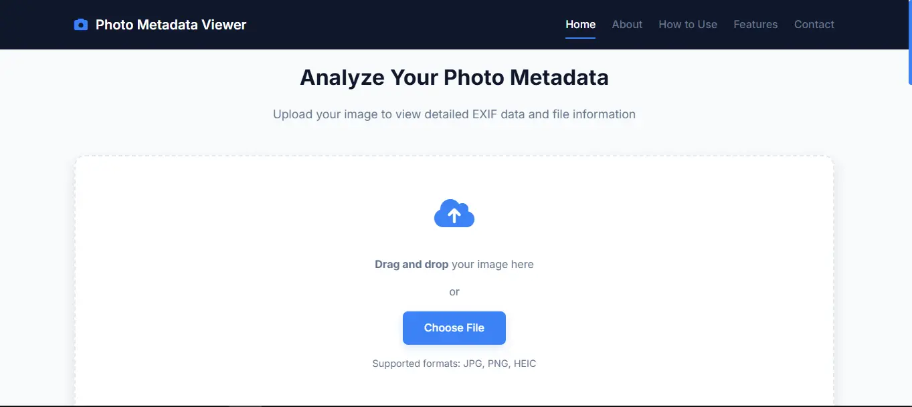

# Photo Metadata Viewer

A powerful, privacy-focused web application that allows photographers, designers, and digital image enthusiasts to analyze and understand the metadata embedded in their photos. All processing happens directly in your browser, ensuring complete privacy and security for your sensitive photos.


*(Add a screenshot of your application here)*

## Features

- 🔒 **Privacy First**: All processing happens locally in your browser - no server uploads required
- 📸 **EXIF Data Extraction**: View detailed camera settings including:
  - Camera model and lens information
  - Aperture, shutter speed, and ISO settings
  - GPS coordinates (if available)
- 📁 **Multiple Format Support**:
  - JPEG/JPG (full EXIF support)
  - PNG (basic properties)
  - HEIC/HEIF (Apple's format)
  - TIFF (extensive metadata)
  - WebP (Google's format)
  - BMP (basic metadata)
- 📱 **Responsive Design**: Works seamlessly on mobile, tablet, and desktop devices
- ⚡ **Fast Processing**: Instant metadata extraction with no waiting times
- 🎨 **Clean Interface**: Intuitive design with easy-to-read metadata display

## How to Use

1. **Upload Your Image**
   - Drag and drop your photo onto the upload area
   - Or click "Choose File" to select an image from your device

2. **View Basic Information**
   - File name and type
   - Image dimensions
   - File size
   - Last modified date

3. **Explore EXIF Data**
   - Expand the EXIF section to view detailed technical metadata
   - All camera settings and image properties are displayed in an organized table format

## Installation

1. Clone the repository:
```bash
git clone https://github.com/AadityaGeek/photo-metadata-viewer.git
```

2. Navigate to the project directory:
```bash
cd photo-metadata-viewer
```

3. Open `index.html` in your web browser to run the application locally

## Technologies Used

- HTML5
- CSS3
- JavaScript
- [Exif.js](https://github.com/exif-js/exif-js) - For extracting EXIF metadata
- Font Awesome - For icons
- Google Fonts (Inter) - For typography

## Browser Support

The application works on all modern browsers including:
- Chrome
- Firefox
- Safari
- Edge

## Contributing

Contributions are welcome! Please feel free to submit a Pull Request.

1. Fork the repository
2. Create your feature branch (`git checkout -b feature/AmazingFeature`)
3. Commit your changes (`git commit -m 'Add some AmazingFeature'`)
4. Push to the branch (`git push origin feature/AmazingFeature`)
5. Open a Pull Request

## Contact

Aaditya Kumar
- GitHub: [@AadityaGeek](https://github.com/AadityaGeek)
- LinkedIn: [aadityakr](https://www.linkedin.com/in/aadityakr)
- Email: work.aadityakumar@gmail.com
- Instagram: [@aadityakr_](https://www.instagram.com/aadityakr_/)

## License

Copyright © 2024 Photo Metadata Viewer. All rights reserved.
